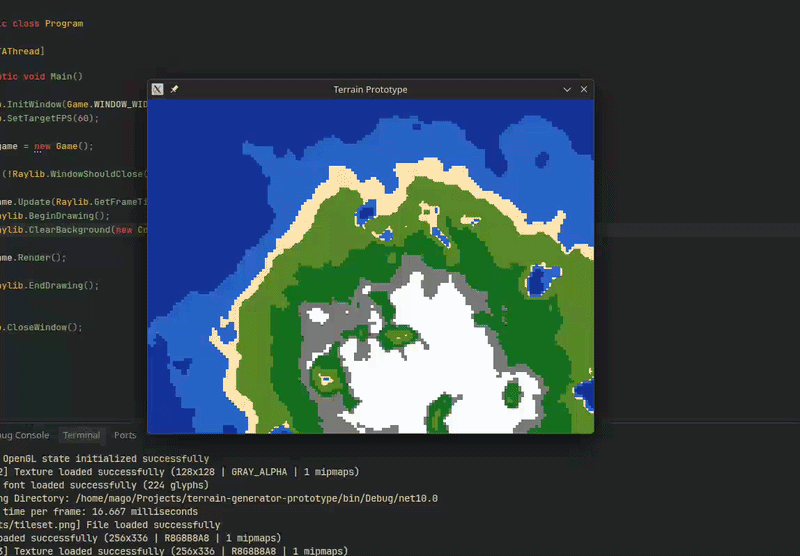

# Terrain Generator Prototype in Raylib C#

This is just a side project to learn Raylib

## Current progress

Just made smooth transitions between sand and grass. I have to make the same thing to the rest of the tiles later...

